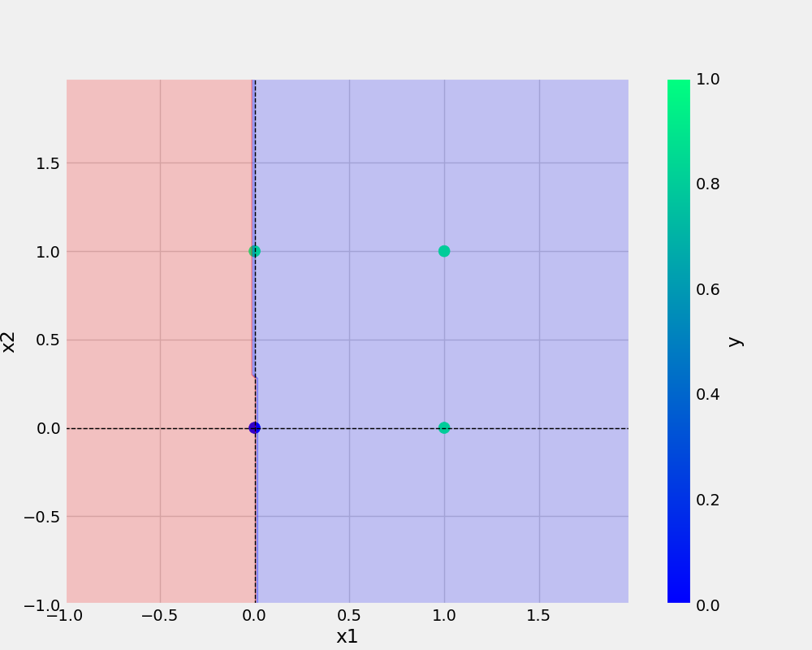

# DeeplearningIneuron
Deep Learning with Ineuron


# Commonds for run in git 

```bash
git add . && git commit -m "docstring" && git push origin main
```


# Copy the path 
```bash
cp Research\ Notebook/demoo.ipynb .
```


# Replace code 

```bash
ctrl+h
```

## URL ADD
[git DeeplearningIneuron](https://github.com/it3037rakesh/DeeplearningIneuron.git)

## Images



